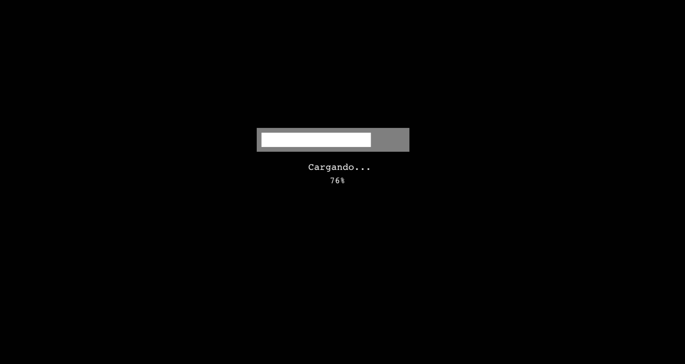
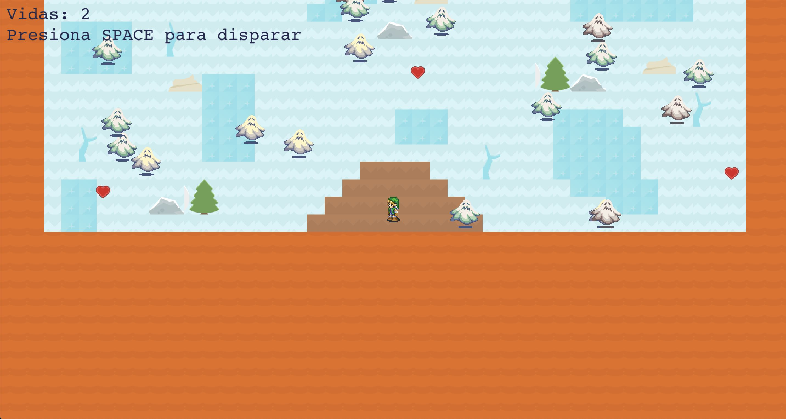
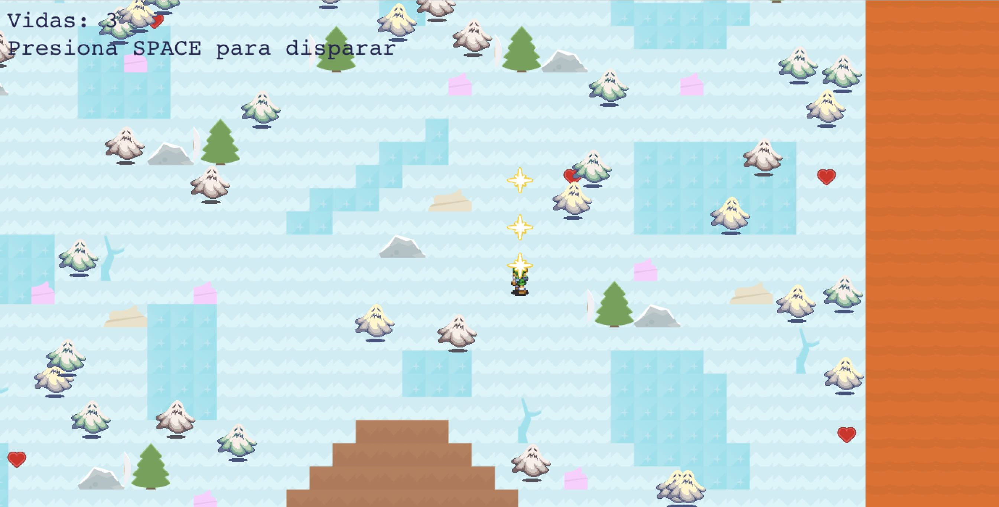
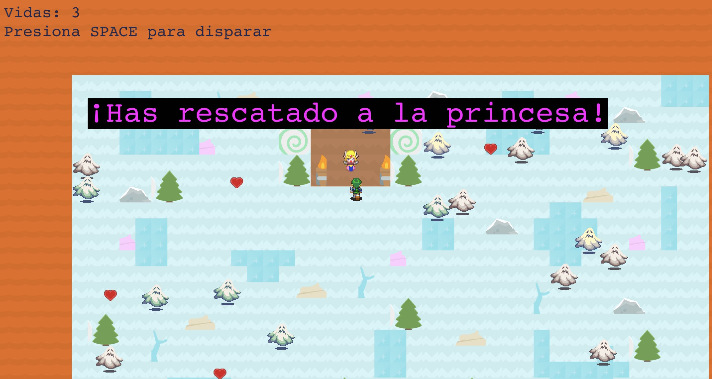

# PhaserGame
## Realizado por: Ángeleles Bueno Aguilar, 2º DAW IES Campanillas.

Juego 2D con Phaser3, NodeJS y ES6

Para jugar, dentro de la carpeta "juego", ejecutar en consola -> node server.js y abrir una ventana del navegador indicando el puerto. Ejemplo -> localhost:8000

